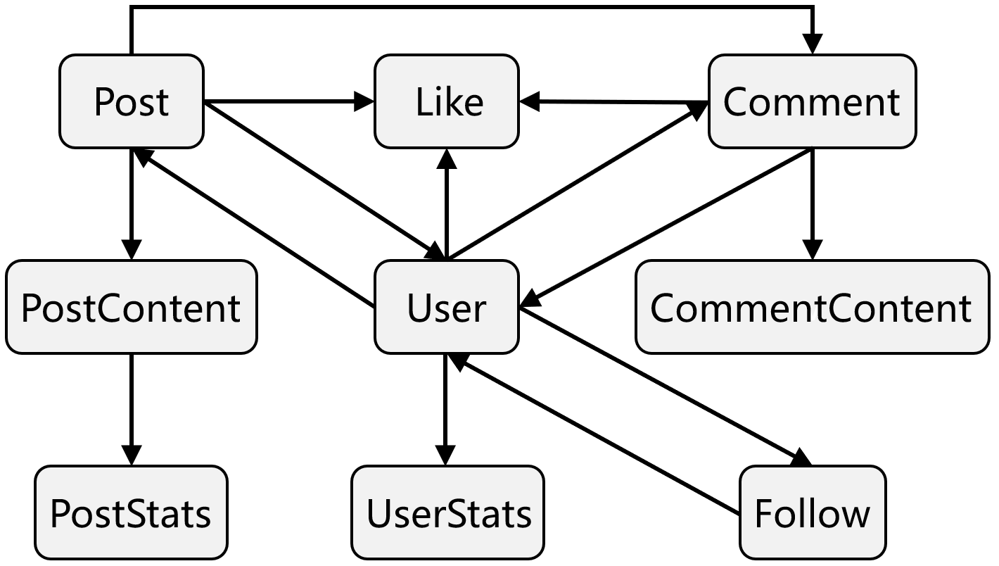

## 数据表关联图

数据表包含  **用户、帖子、评论、点赞** 四个部分，所有数据表都包含自增的物理主键和业务主键 (uuid，候选主键)，用户在登录之后，才可以发帖子，评论与点赞。下面数据表依次按照上述顺序进行陈述。




## 数据表设计

### 1.  用户相关数据表 (User)

####  users

用户表分为三个部分，用户基本信息表 users，用户关注表 follows，用户统计信息表 user_statistics

- **核心必填**：用户名 `username`，登录密码 ` password`，手机号码  `phone` ，尽管理论上使用第三方登录时，登录密码和手机号码字段都可以是空字段，但是我目前不还没了解怎么实现，所以仍是必填字段

- **状态字段**：

  - 用户表通过 `role` 角色字段区分普通用户、审核员和管理员 三种角色，用户注册的时候默认都是普通用户，若要成为审核员或管理员账号需要管理员在数据表上更改。

  - 通过 `status` 字段区分三个用户状态：正常，冻结，封禁。冻结是暂时性的，封禁是永久的，理论上是不可逆的。

  - 用户角色和用户状态通过枚举 Enum 方式选择，不在数据库做强约束

    ```python
    class UserRole(PyEnum):
        NORMAL_USER = 0 # 普通用户
        MODERATOR = 1   # 审核员
        ADMIN = 2       # 管理员
    
    class UserStatus(PyEnum):
        NORMAL = 0  		# 正常
        BANNED = 1  		# 封禁
        FROZEN = 2  		# 冻结
    ```

  - 此外会有重要字段 `deleted_at`，删除用户时通常使用**软删除**，会在 `deleted_at` 填入软删除时间，用户将不对外公开。

```python
class User(Base):
    __tablename__ = "users"
    # 系统主键：自增ID, 不对外暴露
    _id = Column(Integer, primary_key=True, autoincrement=True)  
    # 业务主键：UUID，唯一且不自增  
    uid = Column(String(36), unique=True, default=lambda: str(uuid.uuid4()))  
    username = Column(String(100), nullable=False)  				 # 用户昵称
    avatar_url = Column(String(255), nullable=True)  				 # 用户头像
    email = Column(String(100), unique=True, nullable=True)  # 用户邮箱
    phone = Column(String(50), unique=True, nullable=False)  # 用户电话
    password = Column(String(255), nullable=False)  				 # 密码哈希
    bio = Column(Text, nullable=True)  											 # 用户简介
    
    # 用户角色（普通用户、审核员、管理员）
    role = Column(SmallInteger, default=UserRole.NORMAL_USER.value)  
    # 用户状态（0正常，1封禁，2冻结）
    status = Column(SmallInteger, default=UserStatus.NORMAL.value) 
    
    # 最后登录时间
    last_login_at = Column(TIMESTAMP(timezone=True), default=now_utc8)  
    # 创建时间
    created_at = Column(TIMESTAMP(timezone=True), default=now_utc8)  		
    # 更新时间
    updated_at = Column(TIMESTAMP(timezone=True), default=now_utc8, onupdate=now_utc8)  
    # 软删除时间戳
    deleted_at = Column(TIMESTAMP(timezone=True), nullable=True)  

    # 反向引用：当前用户的所有帖子
    posts = relationship("Post", back_populates="author")
    # 反向引用：当前用户的所有评论
    comments = relationship("Comment", back_populates="author")
    # 反向引用：丢后面用户的所有点赞记录
    likes = relationship("Like", back_populates="user")
    # 单向引用：当前用户的统计信息（关注数和粉丝数）
    userstats = relationship("UserStats", uselist=False, cascade="all, delete-orphan")

    # 关注者（关注者是我 -> 多个 Follow 记录）
    followings = relationship("Follow", foreign_keys="Follow.user_id", back_populates="user")
    # 粉丝 （被关注者是我 -> 多个 Follow 记录）
    followers = relationship("Follow", foreign_keys="Follow.followed_user_id", back_populates="followed_user")
```

用户表可以拓展关注和粉丝两个列表


#### follows

关注表主要用来记录某个用户在何时关注另外一个用户，关注者与受关注者ID是必填的

```python
class Follow(Base):
    __tablename__ = "follows"
    
    _id = Column(Integer, primary_key=True, autoincrement=True)                     
    user_id = Column(String(36), ForeignKey("users.uid"), nullable=False)           # 关注者ID
    followed_user_id = Column(String(36), ForeignKey("users.uid"), nullable=False)  # 受关注ID
    
    created_at = Column(TIMESTAMP(timezone=True), default=now_utc8)  # 记录创建时间
    deleted_at = Column(TIMESTAMP(timezone=True), nullable=True)     # 软删除时间戳

    # 反向引用：该关注记录的关注者
    user = relationship("User", foreign_keys=[user_id], back_populates="followers")
    # 反向引用：该关注记录的被关注者
    followed_user = relationship("User", foreign_keys=[followed_user_id], back_populates="followers")
```


#### user_statistics

由于关注数和粉丝数是一个频繁更新的字段，所以这里额外设计了一个用户统计数据表用来存放这两个字段，后续这个表还可拓展其他频繁更新的用户字段。因为用户的关注列表和粉丝列表涉及关注数和粉丝数的更新，所以业务上规定不允许直接硬删除关注表中的记录，必须先要软删除，软删除逻辑中包含更新关注数和粉丝数，之后才可以硬删除。（硬删除待实现）`

```python
class UserStatistics(Base):
    __tablename__ = "user_statistics"

    id = Column(Integer, primary_key=True, autoincrement=True) 						# 系统主键（自增）
    user_id = Column(String(36), ForeignKey("users.uid"), nullable=False) # 用户ID，外键
    following_count = Column(Integer, default=0)  # 用户关注数
    followers_count = Column(Integer, default=0)  # 用户粉丝数
    
    # 更新时间
    updated_at = Column(TIMESTAMP, 
			default=datetime.datetime.utcnow, 
      onupdate=datetime.datetime.utcnow
		)
```


### 2. 帖子相关数据表 (Post)

| 数据表       | 动静态 | 功能描述                                                     |
| ------------ | ------ | ------------------------------------------------------------ |
| post         | 静态表 | 主要存储帖子的基本信息和状态，e.g. 审核状态，发布状态，帖子可见性等等。 |
| post_comment | 静态表 | 主要存储那些大文本但更新频率较低的内容，e.g. 帖子标题 `title`、帖子内容 `content` |
| post_stats   | 动态表 | 主要存储频繁变动的数据，e.g. 帖子的点赞数 `like_count`，评论数 `comment_count` |


#### posts

帖子表拆分三个部分，帖子基本信息、帖子评论、帖子统计信息：

- **必填字段**：`author_id` 作者 id ，作为外键，对应用户表的 users.uid，`publish_status` 发布状态，直接发布或存草稿。

- **状态字段**：目前主要是可见性状态、发布状态、审核状态

  - 三个可见状态 `visibility`：公开可见，仅作者可见、草稿；

  - 三个审核状态 `review_status`：待审，通过，拒绝，这些同样是通过枚举 Enum 的方式实现的。

    ```python
    # 帖子可见性 (未来可能拓展: 仅关注可见、互关可见)
    class PostVisibility(IntEnum):
        PUBLIC = 0        # 所有人可见
        AUTHOR_ONLY = 1   # 仅作者可见
    
    # 帖子的发布状态
    class PostPublishStatus(IntEnum):
        DRAFT = 0         # 草稿（未发布）
        PUBLISHED = 1     # 已发布
    
    # 帖子审核状态
    class PostReviewStatus(IntEnum):
        PENDING = 0   # 待审
        APPROVED = 1  # 通过
        REJECTED = 2  # 拒绝
    ```

    

```python


class Post(Base):
    __tablename__ = "posts"
    _id = Column(Integer, primary_key=True, autoincrement=True) 
    pid = Column(String(36), unique=True, default=lambda: str(uuid.uuid4()))

    # 帖子作者 ID
    author_id = Column(String(36), ForeignKey("users.uid"), nullable=False)        
    
    # 可见性
    visibility = Column(SmallInteger, default=PostVisibility.PUBLIC.value)         
    
    # 发布状态
    publish_status = Column(SmallInteger, default=PostPublishStatus.PUBLISHED.value)  

    # 审核状态
    review_status = Column(SmallInteger, default=PostReviewStatus.PENDING.value)	
    # 审核时间
    reviewed_at = Column(TIMESTAMP(timezone=True), nullable=True)  								
    # 软删除时间戳
    deleted_at = Column(TIMESTAMP(timezone=True), nullable=True)   

    # 反向引用：该帖子的作者
    author = relationship("User", back_populates="posts")
    # 双向引用：该帖子的评论
    comments = relationship("Comment", back_populates="post")
    # 单向引用：该帖子的内容
    post_content = relationship("PostContent", uselist=False, cascade="all, delete-orphan")
    # 单向引用：该帖子的统计信息
    post_stats = relationship("PostStats", uselist=False, cascade="all, delete-orphan") 
    # 使用 relationship 关联点赞表与帖子表之间的数据，为了方便查询哪些用户点赞这篇帖子
    likes = relationship("Like", primaryjoin="and_(Like.target_id == Post.pid, Like.target_type == 0)", foreign_keys="Like.target_id", viewonly=True)
```


#### post_contents

帖子内容表中**必填字段**：帖子标题 `title`，帖子内容 `content`，帖子ID `post_id` 外键，关联上述数据表，在插入数据库的时候，首先插入的 posts 数据表获取`post_id`，随后才会插入 post_contents

业务主键是 `pcid`

```python
class PostContent(Base):    
    __tablename__ = "post_contents"
    
    id = Column(Integer, primary_key=True, autoincrement=True)  
    pcid = Column(String(36), unique=True, nullable=False, default=lambda: str(uuid.uuid4())) 
    
    post_id =  Column(String(36), ForeignKey("posts.pid"), nullable=False)   # 帖子ID         
    title = Column(String(255), nullable=False)                  						 # 帖子标题
    content = Column(Text, nullable=False)                       						 # 帖子内容
    
    created_at = Column(TIMESTAMP(timezone=True), default=now_utc8)
    updated_at = Column(TIMESTAMP(timezone=True), default=now_utc8, onupdate=now_utc8)
```

 

#### post_stats

帖子统计数据表中**必填字段**：帖子ID `post_id` 外键。注意到这里有点赞数和评论数，所以点赞表和评论表的记录不可以乱删，一旦删除势必会级联影响 PostStats，因而策略上面，采用先软删除，再硬删除的策略。软删除逻辑包含更新点赞数和评论数。

```PYTHON
class PostStats(Base):
    __tablename__ = "post_stats"

    _id = Column(Integer, primary_key=True, autoincrement=True) 
    psid = Column(String(36), unique=True, nullable=False, default=lambda: str(uuid.uuid4())) 
    
    post_id = Column(String(36), ForeignKey("posts.pid"), nullable=False) # 帖子 ID
    like_count = Column(Integer, default=0)                               # 帖子点赞数
    comment_count = Column(Integer, default=0)                            # 帖子总评论数
    
    # 后续可扩展收藏数，转发数
```

综上所述，创建一篇帖子的请求体必填字段：`author_id`，`publish_status`，`title`，`content`


### 3. 评论相关数据表 (Comment)

同样遵循动态表和静态表结合的设计理念，评论功能共包含两个表

| 数据表           | 动静态 | 功能描述                                                     |
| ---------------- | ------ | ------------------------------------------------------------ |
| comments         | 静态表 | **存储每一条评论的基本信息**与统计信息，e.g. 父评论 `parent_id`，评论的点赞数等。 |
| comment_contents | 静态表 | 评论内容是大字段且相对独立、很少修改，因此独立设计这评论内容表作为静态表。 |


#### comments

**评论区表记录的是每一条评论信息，不包含具体的评论内容**，由于评论篇幅可能很长，且多读少改 (甚至不改)，评论数据表的重难点在于如何处理楼中楼的拉取，以及级联删除。

- **必填字段**：评论作者`author_id`，外键关联用户表 id， 帖子id `post_id` 外键关联帖子 id， 以及评论的父评论 `parent_id`，根评论 `root_id`，提及到评论的父评论和根评论，这里补充分级评论设计规则：

  - 分层设计

    - 一级：`parent_id is NULL` 且 `root_id = cid`

    - 二级：`parent_id = root_id`

    - 三级及以上：`parent_id != root_id` 且 `parent_id is not NULL`

  - **楼中楼拉取**：上述规则的好处是任何楼中楼对话，可以通过以下命令一次性把整组对话拉出来，

    ```mssql
    SELECT * FROM comments WHERE root_id = :root_cid
    ```

  - **动态字段**：评论表中会有点赞数与评论数相关字段

    -  `comment_count` 代表 **评论的评论数**，这条评论新增一条回复要在更新这个字段
    - `like_count` 代表的**评论的点赞数**，点赞功能在点赞表中详细介绍。

  

- **状态字段**：主要板材可见性字段和审核状态字段

  - 评论可见性状态 `status`：正常/折叠；**低质量评论（例如大篇幅@他人，无意义内容）可以折叠起来不直接显示给用户**。

  - 三个审核状态 `review_status`：待审，通过，拒绝。同样地，使用枚举 Enum 实现。

    ```python
    # 评论显示状态
    class CommentStatus(IntEnum):
        NORMAL = 0    # 正常展示
        FOLDED = 1    # 折叠（低质量/被投票降低等）
    
    # 审核状态
    class ReviewStatus(IntEnum):
        PENDING  = 0  # 待审
        APPROVED = 1  # 通过
        REJECTED = 2  # 拒绝
    ```

    

    

  删除评论采用的是**软删除**方式，字段 `deleted_at` 非空时表示评论以及被软删除。

**评论相关业务规则**

- **评论审核**：评论使用审核用户没有办法感受到实时性，所以这里**采用的审核制度是先发后审**：用户评论直接展示，后台异步审核，检测到违规在前端折叠或删除，后续可以采用人工加机器结合的方式审。

- **评论删除**：
  - 在删除一级评论的时候，理论上需要删除所有回复一级评论子评论，但是为了避免 **写放大**，所以一般不会直接删除子评论，只将一级评论的 `deleted_at` 字段设为非空。随后子评论消失看不见，与查询逻辑有关（如果根评论被删，那么相关回复都将消失）

- 删除子评论时，也是同样设置 `deleted_at` 字段设为非空，但是子评论的所有子评论不消失。
- 在页面展示的时候只有一级评论，以及一级评论的评论数和点赞数。需要查看二级或更多级评论需要点击新查询接口。实现起来很简单，把同一个 root_id 所有评论按时间顺序返回，业务上依旧实现了查看楼中楼对话组的功能，详情看代码。

```python

    
class Comment(Base):
    __tablename__ = "comments"
    
    _id = Column(Integer, primary_key=True, autoincrement=True)
    cid = Column(String(36), unique=True, nullable=False, default=lambda: str(uuid.uuid4()))
    
    post_id = Column(String(36), ForeignKey("posts.pid"), nullable=False)   # 评论ID
    comment_count = Column(Integer, default=0)                              # 评论数
    author_id = Column(String(36), ForeignKey("users.uid"), nullable=False) # 评论作者 ID
    parent_id = Column(String(36), nullable=True)                           # 父评论 ID
    root_id = Column(String(36), nullable=True)                             # 顶级评论 ID
    like_count = Column(Integer, default=0, nullable=False)                 # 点赞数  
    
    # 评论状态（正常/折叠）
    status = Column(SmallInteger, default=CommentStatus.NORMAL.value, nullable=False) 
    # 审核状态（待审/通过/拒绝）
    review_status = Column(SmallInteger, default=ReviewStatus.PENDING.value, nullable=False)    
    reviewed_at = Column(TIMESTAMP(timezone=True), nullable=True)    # 审核时间
    created_at = Column(TIMESTAMP(timezone=True), default=now_utc8)  # 创建时间
    deleted_at = Column(TIMESTAMP(timezone=True), nullable=True)     # 软删除时间戳

    # 反向引用：该评论区的作者
    author = relationship("User", back_populates="comments")
    # 反向引用：该帖子的评论总览信息（包含帖子ID），可能希望通过评论跳转帖子
    post = relationship("Post", back_populates="comments")

    # 单向引用：该评论区的评论内容
    comment_content = relationship(
      "CommentContent", uselist=False, cascade="all, delete-orphan")
    
    # 单向引用：该评论区的点赞
    likes = relationship(
      "Like", primaryjoin="and_(Like.target_id == Comment.cid, Like.target_type == 1)",
      foreign_keys="Like.target_id", viewonly=True)
```


#### comment_contents

**评论内容表存储的是评论的具体内容**，**必填字段**，评论内容 `content`，综上所述，插入一条评论的请求体必填字段为：`post_id`，`author_id`，`parent_id`，`root_id`，`content`

```python
class CommentContent(Base):   
    __tablename__ = "comment_contents"
    
    _id = Column(Integer, primary_key=True, autoincrement=True)                               
    ccid = Column(String(36), unique=True, nullable=False, default=lambda: str(uuid.uuid4())) 
    
    comment_id = Column(String(36), ForeignKey("comments.cid"), nullable=False)  # 评论区 ID
    content = Column(Text, nullable=False)                                       # 评论内容
    
    created_at = Column(TIMESTAMP(timezone=True), default=now_utc8)
    updated_at = Column(TIMESTAMP(timezone=True), default=now_utc8, onupdate=now_utc8)
```


### 4. 点赞相关数据表 (Like)

点赞主要用来**记录某个用户点赞帖子或评论的记录**，同时可以用来 **约束每个用户对一个帖子或评论，仅能点一个赞**。

- **必填字段**：用户 ID `user_id`，点赞目标类型 `target_type` (0: 帖子, 1: 评论)，以及目标帖子或评论 ID `target_id`
- **关联字段**：用户表，评论表，帖子表都需要关联点赞表的数据，虽然这些表本身只显示点赞数，但是可以方便查询是用户点赞了哪篇帖子或评论，又或是，哪些用户点赞这篇帖子评论。

```python
# 点赞目标类型
class LikeTargetType(PyEnum):
    POST = 0  # 帖子
    COMMENT = 1  # 评论

class Like(Base):
    __tablename__ = "likes"
   
    _id = Column(Integer, primary_key=True, autoincrement=True)
    lid = Column(String(36), unique=True, default=lambda: str(uuid.uuid4()))
    user_id = Column(String(36), ForeignKey("users.uid"), nullable=False)  # 用户 ID
    target_type = Column(SmallInteger, nullable=False)                     # 点赞目标类型
    target_id = Column(String(36), nullable=False)                         # 点赞目标 ID
    
    created_at = Column(TIMESTAMP, default=datetime.datetime.utcnow)
    updated_at = Column(TIMESTAMP(timezone=True), default=now_utc8, onupdate=now_utc8) 
    deleted_at = Column(TIMESTAMP, nullable=True)
```

因为点赞的对象即可以是评论也可能是帖子，所以点赞表是一个“多态关联”，i.e. 通过一个 `target_id` 指向两个表，此时需要显示标记哪一列是外键那一边，比如下面的代码，用 `foreign()` 把 `Like.target_id` 标记为“外键侧”

```python
# 反向引用：该点赞的帖子（如果是帖子点赞）
post = relationship("Post", back_populates="likes", uselist=False, primaryjoin="and_(foreign(Like.target_id) == Post.pid, Like.target_type == 0)", viewonly=True)

# 反向引用：该点赞的评论区（如果是评论区点赞）
comment = relationship("Comment", back_populates="likes", uselist=False, primaryjoin="and_(foreign(Like.target_id) == Comment.cid, Like.target_type == 1)", viewonly=True)    
```

这样写的好处是关系自动填充，不用手动声明，代码上更简洁，但是在实际业务上可能会更加推荐把上面的多态关联去掉，不在模型上声明多态关系，而是在数据层根据 target_type 主动查询目标表，并在业务层或数据层填充响应体。


